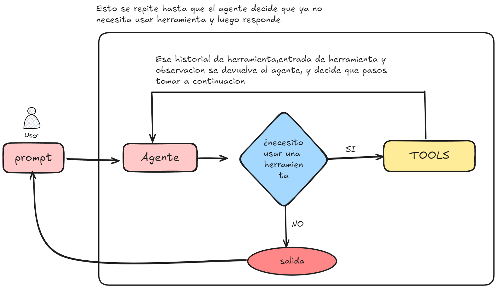

# Langchain Agentes

Este proyecto implementa un agente de Langchain utilizando el modelo `OllamaLLM`, capaz de realizar operaciones matemáticas simples, como sumar y restar números, mediante el uso de herramientas integradas.

### Diagrama de un agente 



## Requisitos

Antes de ejecutar este proyecto, asegúrate de tener instalados los siguientes módulos:

- `langchain_ollama`: Para la integración con el modelo `OllamaLLM`.
- `langchain`: Para el manejo de herramientas y la creación de agentes.

Instala los requisitos usando:

```bash
pip install langchain_ollama langchain
````
para usar wikipedia langchain
```bash
pip install --upgrade --quiet  wikipedia
````
para usar playwright langchain
```bash
pip install --upgrade --quiet  playwright > $null
pip install --upgrade --quiet  lxml
playwright install
